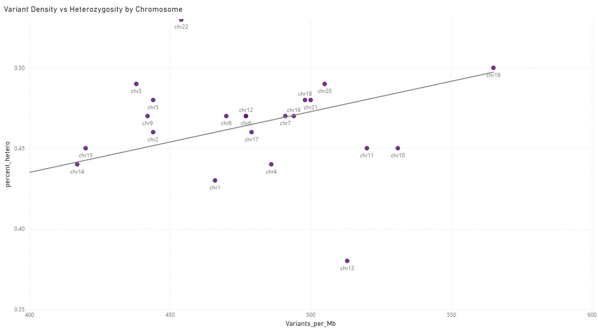

# Genomic Variant Analysis (SQL + Power BI)

End-to-end genomic data analysis project using SQL and Power BI to clean, normalize, analyze, and visualize large-scale variant data across human chromosomes.

This project started as an Excel-based exploration and eventually moved into a full SQL-driven workflow once the dataset size made spreadsheet processing impractical.

---

## Project Highlights

- Processed and analyzed approximately 1.4 million genomic variant records
- Built a SQL-based data cleaning and normalization pipeline
- Aggregated chromosome-level genotype metrics and density statistics
- Compared genotype composition across chromosomes
- Visualized variant density and heterozygosity relationships in Power BI
- Worked through a significant amount of import, datatype, and normalization debugging throughout development

---

## Key Questions Explored

- Which chromosomes contain the highest variant density?
- How do heterozygous and homozygous variant distributions differ across chromosomes?
- Do chromosomes with higher variant density also show higher heterozygosity?
- Which chromosomes behave as statistical outliers?

---

## Tools Used

| Tool | Purpose |
|---|---|
| SQL (MySQL) | Data cleaning, transformation, aggregation |
| Power BI | Data visualization and exploratory analysis |
| Excel | Initial exploration and sampling |
| GitHub | Documentation and version control |

---

## Project Structure

```text
genomic-variant-analysis/
│
├── README.md
├── sql/
│   └── analysis_queries.sql
├── notes/
│   └── debugging_log.md
├── images/
│   ├── density_by_chromosome.png
│   ├── genotype_percentages.png
│   └── scatter_plot.png
```

---

## Data Cleaning Workflow

The original dataset contained approximately 2.4 million genomic records with multiple chromosome naming conventions, alternative contigs, and mixed genotype formats.

Cleaning and normalization steps included:

- Filtering for passing variants only
- Standardizing genotype formatting
- Consolidating alternative chromosome labels into standard chromosome groups
- Removing incomplete or malformed rows
- Building chromosome-level summary tables
- Creating normalized density and composition metrics

Final cleaned dataset size: approximately 1.4 million rows.

---

## Visualization 1: Variant Density by Chromosome and Genotype

This chart compares normalized variant density across chromosomes for heterozygous, homozygous, and multi-heterozygous variants.

Key observations:
- chr13 showed unusually high homozygous density
- chr19 consistently showed high overall variant density
- Multi-heterozygous variants remained relatively sparse across all chromosomes

<p align="center">
  
</p>

---

## Visualization 2: Genotype Composition by Chromosome

This chart compares the proportional distribution of heterozygous, homozygous, and multi-heterozygous variants by chromosome.

Key observations:
- Most chromosomes showed fairly stable distributions
- chr13 had elevated homozygosity
- chrY behaved as a strong outlier with substantially lower heterozygosity

<p align="center">
  
</p>

---

## Visualization 3: Variant Density vs Heterozygosity

Scatter plot comparing chromosome-level heterozygosity against chromosome size, used to identify clustering behavior, outlier chromosomes, and potential relationships between chromosome scale and variation patterns.

<p align="center">
  
</p>

---

## Key Lessons Learned

- Large datasets require different workflows than spreadsheet-based analysis
- SQL schema design significantly impacts import performance and downstream calculations
- Mathematical correctness does not always guarantee analytical correctness
- Clear metric naming is critical when working with normalized data
- Iterative debugging and restructuring are a normal part of real-world analysis

---

## Development Notes

See `sql/analysis_queries.sql` and `notes/debugging_log.md` for the full SQL workflow, debugging process, and schema adjustments made throughout development.

---

## Final Workflow

Raw Genomic Data  
→ SQL Cleaning & Normalization  
→ Aggregation & Metric Engineering  
→ Power BI Visualization  
→ Exploratory Analysis & Interpretation
